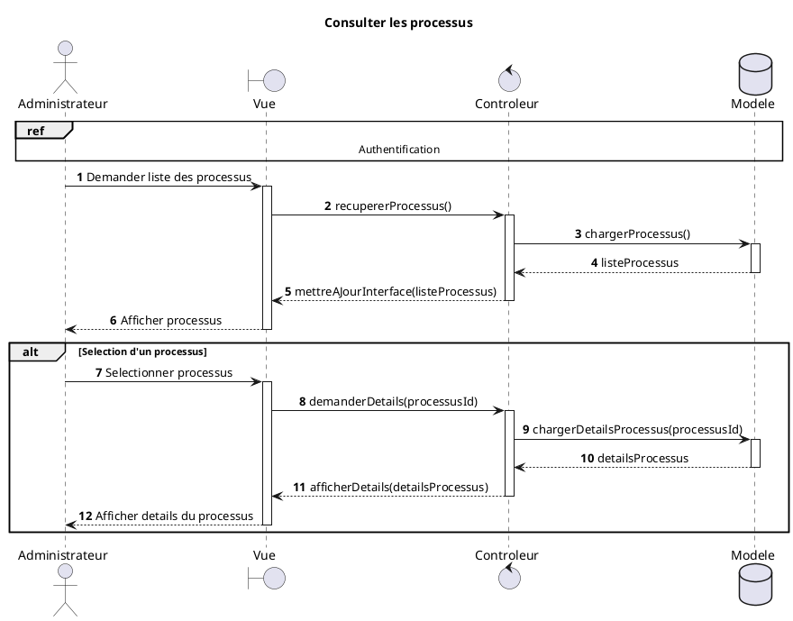
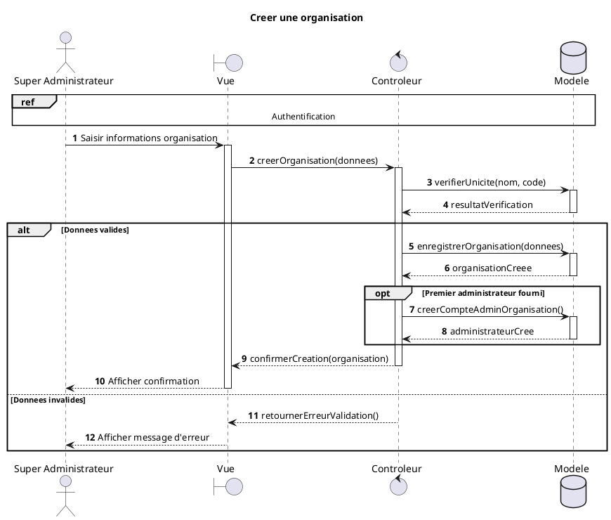
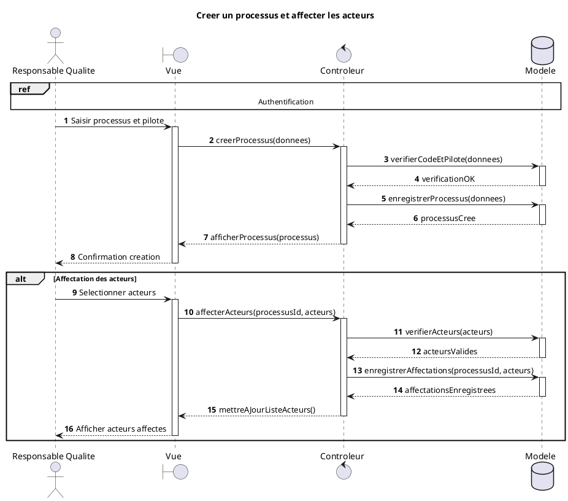
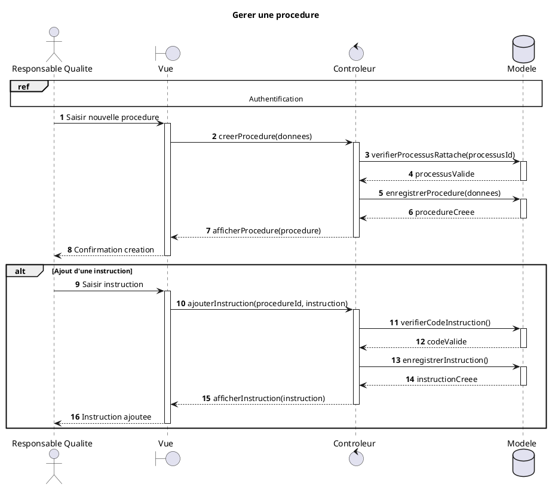
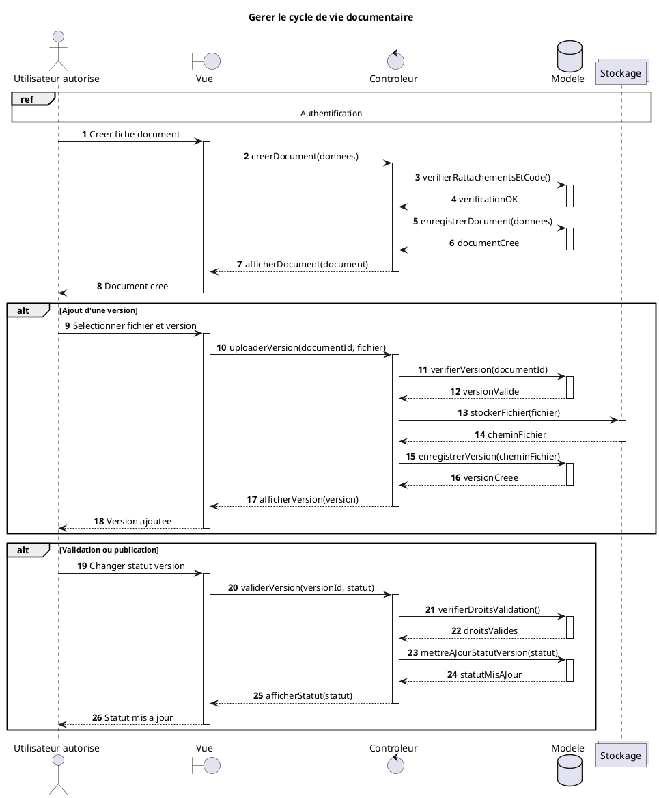
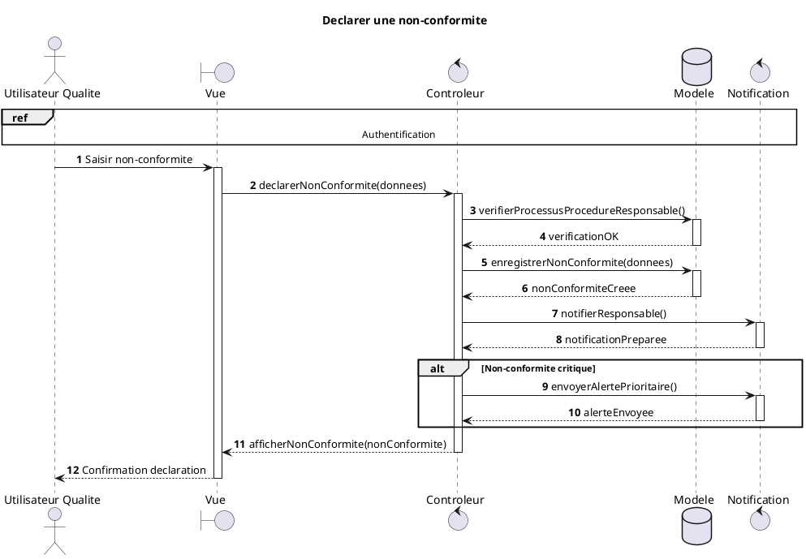
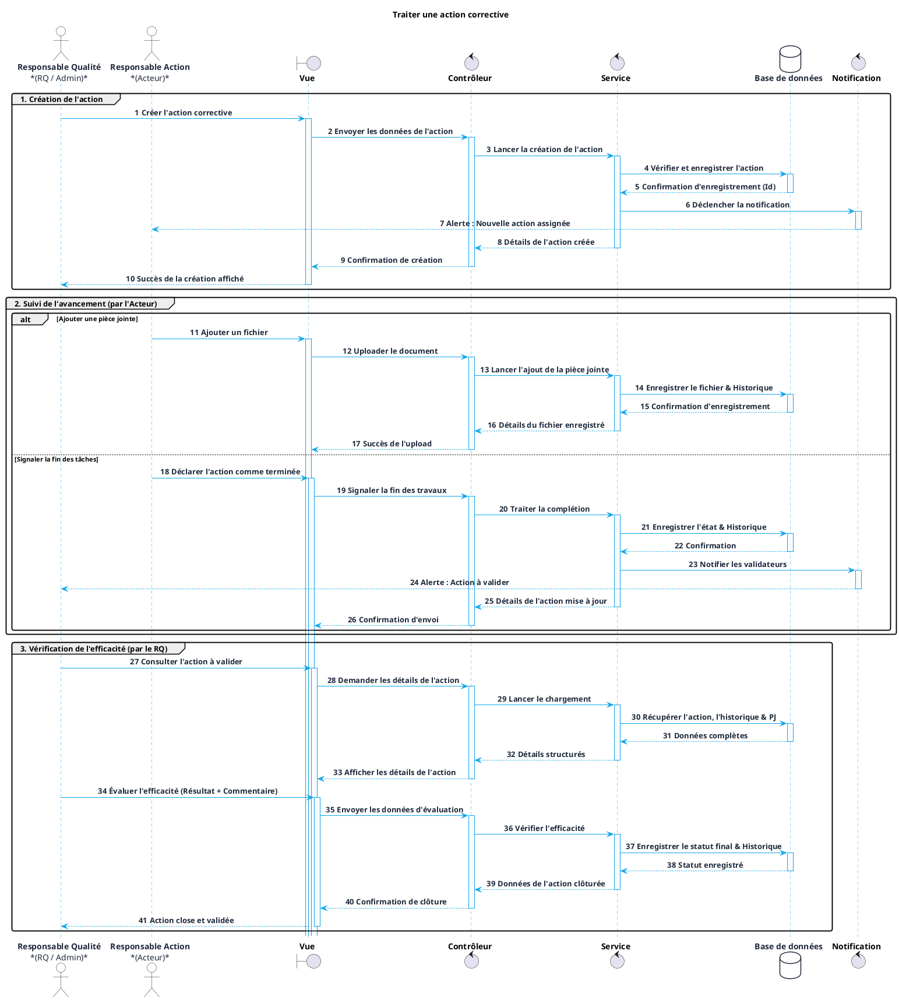
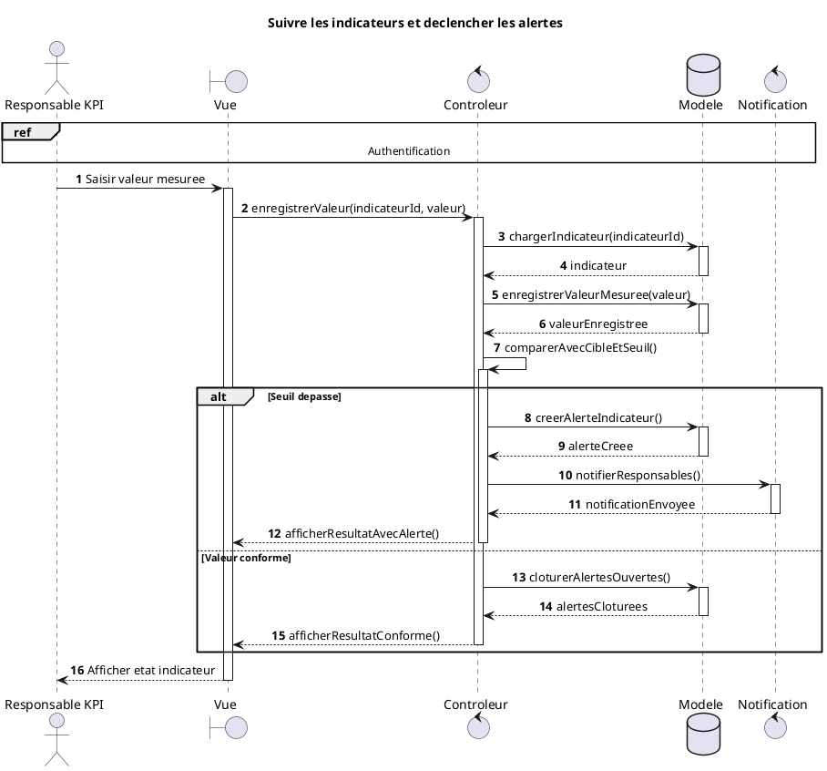
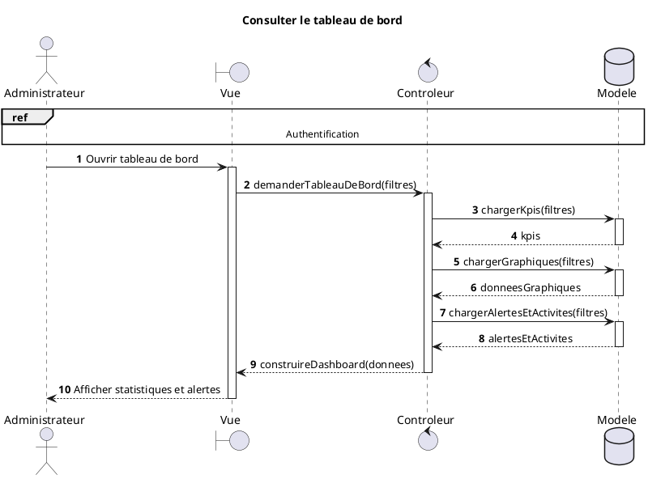
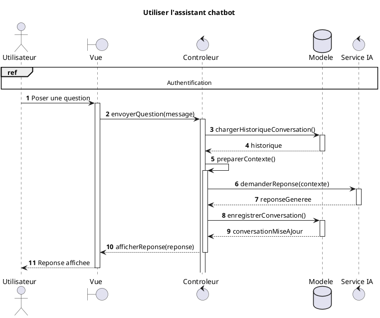

# Diagrammes de sequence academiques MVC - QualiFlow

Ces diagrammes sont prepares pour le memoire avec une presentation proche du modele academique classique: Acteur, Vue, Controleur et Modele. Les details techniques internes du backend sont regroupes dans le participant "Modele" afin de garder des figures lisibles.

## 1. Consulter les processus

## 2. Creer une organisation

## 3. Creer un processus et affecter les acteurs

## 4. Gerer une procedure

## 5. Gerer le cycle de vie documentaire

## 6. Declarer une non-conformite

## 7. Traiter une action corrective

## 8. Suivre les indicateurs et declencher les alertes

## 9. Consulter le tableau de bord

## 10. Utiliser l'assistant chatbot

